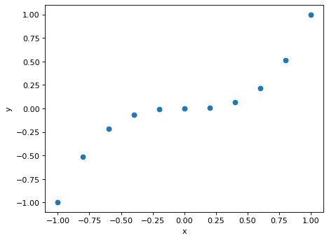
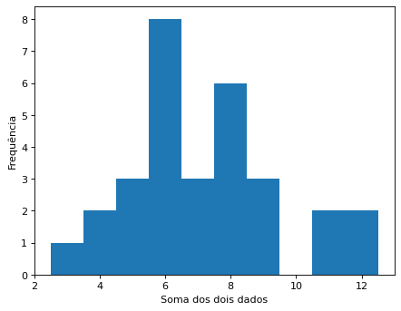
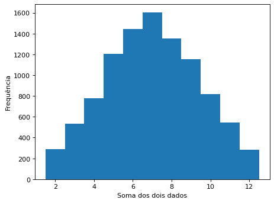
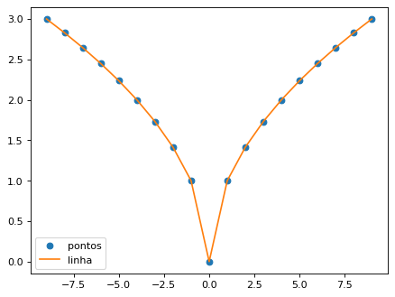
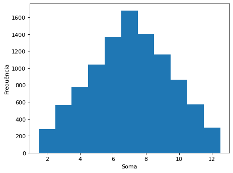

# Pacotes e Ajuda em Python

Slides: [02-Pacotes-Ajuda.pdf](../02-Pacotes-Ajuda.pdf)

Exemplos de código da aula sobre funções, pacotes e o sistema de ajuda. O fio condutor é a simulação do lançamento de dois dados.

## Funções

Uma função recebe parâmetros, executa um processamento e devolve um resultado com `return`.

```python
def cubo(x):
    return x**3

print(cubo(2))
```

```text
8
```

## Argumentos posicionais e nomeados

Argumentos podem ser passados pela posição ou pelo nome do parâmetro. Em `np.mean`, o primeiro parâmetro se chama `a`.

```python
import numpy as np
x = np.array([1, 2, 3, 4])
print(np.mean(x))      # posicional
print(np.mean(a=x))    # nomeado
```

```text
2.5
2.5
```

## Instalação de pacotes

Pacotes externos vêm do PyPI e são instalados com `pip`, dentro de um ambiente virtual. A instalação é feita uma vez por projeto, no terminal; o `import` é feito em todo script que usa o pacote.

```bash
python -m venv .venv
.venv\Scripts\Activate.ps1     # Windows (PowerShell)
# source .venv/bin/activate    # Linux/macOS
pip install numpy pandas matplotlib
# versão de desenvolvimento direto do GitHub:
# pip install git+https://github.com/usuario/projeto.git
```

```python
import numpy as np
import pandas as pd
import matplotlib.pyplot as plt
```

## Gráfico rápido com matplotlib

Geramos pontos de `x` entre -1 e 1 e calculamos `y = x³`. Como `x` é um array, `x**3` é aplicado a todos os elementos.

```python
x = np.array([-1, -0.8, -0.6, -0.4, -0.2, 0, 0.2, 0.4, 0.6, 0.8, 1.0])
y = x**3
plt.scatter(x, y)
plt.xlabel("x")
plt.ylabel("y")
plt.show()
```



## Prototipando no console

Antes de escrever a função, testamos a lógica linha a linha: sorteamos dois valores de 1 a 6, com reposição, e somamos. Fixamos a semente (`seed`) para que os resultados deste documento sejam reproduzíveis.

```python
np.random.seed(42)
dado = np.arange(1, 7)
dados = np.random.choice(dado, size=2, replace=True)
print(dados, dados.sum())
```

```text
[4 5] 9
```

## A função jogada()

Validada a lógica, encapsulamos em uma função sem parâmetros. As variáveis `dado` e `dados` são locais e não poluem o restante do programa.

```python
def jogada():
    dado = np.arange(1, 7)
    dados = np.random.choice(dado, size=2, replace=True)
    return int(dados.sum())

jogada()
```

```text
8
```

## Simulação com 30 amostras

Com poucas amostras a distribuição das somas fica irregular. Usamos classes de largura 1 centradas em cada soma inteira.

```python
amostras = np.array([jogada() for _ in range(30)])
bins = np.arange(amostras.min() - 0.5, amostras.max() + 1.5, 1)
plt.hist(amostras, bins=bins)
plt.xlabel("Soma dos dois dados")
plt.ylabel("Frequência")
plt.show()
```



## Espaço de possibilidades

Há 36 pares (D1, D2). A soma 7 tem 6 combinações; as somas 2 e 12 têm só uma. Por isso a distribuição tem forma triangular.

```python
comb = []
for d1 in range(1, 7):
    for d2 in range(1, 7):
        comb.append((d1 + d2, (d1, d2)))

df = pd.DataFrame(comb, columns=["soma", "par"])
tabela = df.groupby("soma")["par"].apply(list).reset_index()
tabela["n"] = tabela["par"].apply(len)
print(tabela[["soma", "n"]])
```

```text
    soma  n
0      2  1
1      3  2
2      4  3
3      5  4
4      6  5
5      7  6
6      8  5
7      9  4
8     10  3
9     11  2
10    12  1
```

## Simulação com 10.000 amostras

Com muitas amostras, a distribuição empírica se aproxima da teórica e o 7 aparece como valor mais frequente.

```python
amostras = np.array([jogada() for _ in range(10000)])
bins = np.arange(1.5, 12.6, 1)
plt.hist(amostras, bins=bins)
plt.xlabel("Soma dos dois dados")
plt.ylabel("Frequência")
plt.show()
```



## Sistema de ajuda

`help()` mostra a documentação de qualquer função: descrição, parâmetros, retorno e exemplos. Em IPython e notebooks, `np.sqrt?` tem o mesmo efeito. Abaixo, a média das 10.000 somas (o valor teórico é 7):

```python
np.mean(amostras)
```

```text
np.float64(6.9948)
```

```python
help(np.sqrt)
```

## Reproduzindo um exemplo da documentação

Raiz quadrada do valor absoluto: primeiro os pontos isolados (`'o'`) e depois os mesmos pontos ligados por segmentos de reta (`'-'`).

```python
xx = np.arange(-9, 10)
yy = np.sqrt(np.abs(xx))
plt.plot(xx, yy, 'o', label="pontos")
plt.plot(xx, yy, '-', label="linha")
plt.legend()
plt.show()
```



## Amostragem com as probabilidades teóricas

Também podemos sortear a soma diretamente, com peso proporcional ao número de combinações (de 1/36 a 6/36). Isso equivale a lançar dois dados e somar: a variação aleatória continua presente. Se o histograma for igual ao anterior, a tabela das 36 combinações está correta.

```python
valores = np.arange(2, 13)
probs = np.array([1, 2, 3, 4, 5, 6, 5, 4, 3, 2, 1]) / 36
amostras = np.random.choice(valores, size=10000, p=probs)
plt.hist(amostras, bins=np.arange(1.5, 12.6, 1))
plt.xlabel("Soma")
plt.ylabel("Frequência")
plt.show()
```



## Referências

1. Downey, A. *Think Python: How to Think Like a Computer Scientist*. O'Reilly Media.
2. VanderPlas, J. *Python Data Science Handbook*. O'Reilly Media.
3. Grus, J. *Data Science from Scratch*. O'Reilly Media.
